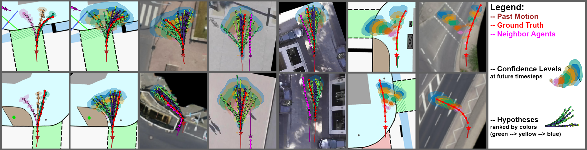
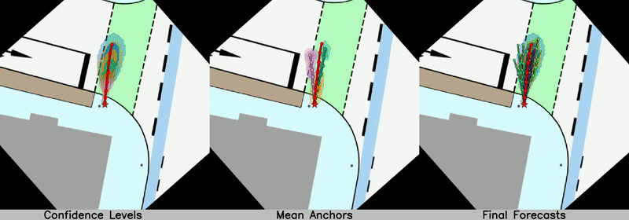
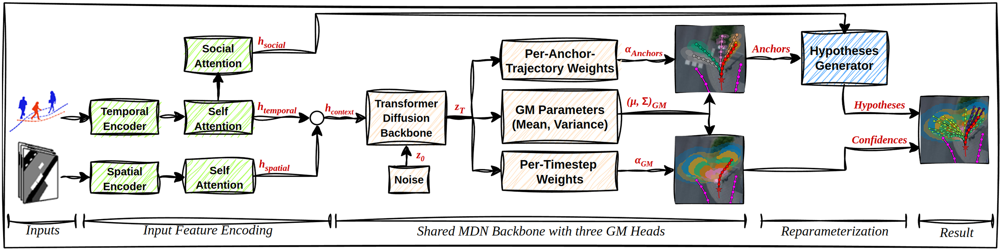

### DDMDN: Diffusion-Based Trustworthy Human Trajectory Prediction

 


#### This is the official implementation for: 

_**Diffusion-Based Trustworthy Human Trajectory Prediction with Dual Mixture Density Networks and Uncertainty Self-Calibration**_
Paper: tba <!-- [[arXiv]()] [[ResearchGate]()] -->

_**Abstract**_ --  Human Trajectory Forecasting (HTF) aims to predict future human movements from past trajectories and environmental context, with applications in Autonomous Driving (AD), Smart Surveillance, and Human-Machine Interaction. While prior work emphasizes forecasting accuracy, social interaction handling, and hypotheses diversity, no assessment is made of the correctness of distribution uncertainty and calibration. Furthermore, the accuracy of forecasts at short observation periods is often not evaluated. However, downstream tasks, such as AD path planning and robotic collision avoidance, rely on fast, trustworthy, and calibrated forecasts with meaningful uncertainty estimates. We introduce an end-to-end probabilistic HTF model (DD-MDN) that unifies positional accuracy and reliable uncertainty handling. Built on a few‑shot denoising diffusion backbone, a dual Mixture Density Network generates self-calibrated future residence areas with probability‑ranked anchor paths, from which diverse discrete trajectory hypotheses are derived. This formulation ensures self‑calibrated uncertainty, multimodality, and accurate probability assignments, all learned directly from data without predefined anchors or endpoints. Experiments with the ETH/UCY, SDD, inD, and IMPTC datasets demonstrate new state-of-the-art positional accuracy and robustness against short observation periods, enhanced by reliable and calibrated uncertainty modeling.

**Cite:**

    @article{ddmdn_2025,
        title={Diffusion-Based Trustworthy Human Trajectory Prediction with Dual Mixture Density Networks and Uncertainty Self-Calibration},
        author={},
        journal={},
        year={2025},
        organization={},
        doi={}
    }



_**Architecture**_ -- DD-MDN is an end-to-end framework that consists of three parts (Encoding, Probabilistic Modeling, and Deterministic Hypotheses Generation). An architectural overview is illustrated by the figure above. Classic encoder networks provide input data encoding; LSTM is used for temporal inputs (past agent motions); CNN is used for spatial data (map information); and transformers are used for self- and social-attention matters. Probabilistic modeling processes temporal and spatial input features and is achieved by a dual MDN, consisting of a shared denoising diffusion backbone and three probabilistic heads that derive two types of distributional representations: a per-timestep and a per-anchor-trajectory representation. The architecture can handle various continuous probability distributions, including Gaussian, Laplace, Cauchy, and others. For this work, we use Gaussians Mixtures (GM). The per-timestep representation is necessary for trustworthy uncertainty modeling and calibration. The future state distribution at each time is represented by a multimodal GM. The per-anchor-trajectory representation is necessary for natural and realistic discrete hypotheses generation, delivering full time-stable and individually weighted M future trajectory distributions in a trajectory spce. The individual core parameters mean and variances are shared between both representations; however, their arrangement differs per representation. The weights are separated. Deterministic modeling processes temporal and social input features, to generate K uncertainty-related discrete future trajectory hypotheses using affine reparameterization sampling. A detailed description of the architecture is provided in the full paper.



---
### Table of contents:
* [Quick Start](#quick_start)
* [Requirements](#requirements)
* [Datasets](#datasets)
* [Pretrained Models](#pretrained)
* [Training](#training)
* [Evaluation](#evaluation)
* [License](#license)

---
<a name="quick_start"></a>
### Quick Start


**1.) Pull docker image:**
```bash
docker pull asterix19/ddmdn:1.0 
```

**2.) Download preprocessed datasets and pretrained models:**
--> [Download DDMDN Data](https://drive.google.com/drive/folders/1CVIPTMtpfind3CArV0yvZ_zT_UHOWoTN?usp=sharing)

```bash
# Extract "benchmarks", "full" and "trained_models" directories to:
.../ddmdn/datasets/

# Result:
.../ddmdn/datasets/benchmarks
.../ddmdn/datasets/full
.../ddmdn/datasets/trained_models
```

**3.) Clone repository:**
```bash
Download from: https://anonymous.4open.science/r/ddmdn-45F6

# Extract repository to:
.../ddmdn/repos/

# Result:
.../ddmdn/repos/ddmdn
```

**4.) Set paths and user id in user.env:**
```bash
# User.env file path:
cd .../ddmdn/datasets/ddmdn/docker

# Define:
USER_ID=...
DATA_PATH='/.../ddmdn/datasets/'            ---> Is mapped in the container to: /workspace/data
REPOS_PATH='/.../ddmdn/repos/ddmdn'      ---> Is mapped in the container to: /workspace/repos
```

**5.) Start the container:**
```bash
cd .../ddmdn/repos/ddmdn/docker
docker compose --env-file user.env build up -d
```

**6.) Connect to the container:**
Connect with your preferred IDE or via terminal to the docker container and your ready to go. To run an evaluation or training see [Training](#training) and [Evaluation](#evaluation) sections below.


---
<a name="requirements"></a>
### Requirements

The framework uses the following system configuration. All specific python requirements can be found in the corresponding requirements.txt file and are already pre-installed in the provided docker container.

```
# Software
Ubuntu 22.04 LTS
Python 3.10
Pytorch 2.5.0
CUDA 12.6
CuDNN 9.5

# Used Hardware:
Ryzen 9950X
32 GB RAM
RTX 4090
```

### Docker
**From scratch:** We used and recommend the Nvidia NGC Pytorch 24.10 image. Run the image and install the corresponding python requirements.txt and your ready to go.
- [[Nvidia NGC Pytorch 24.10]](https://docs.nvidia.com/deeplearning/frameworks/pytorch-release-notes/rel-24-10.html) [[Nvidia NGC Pytorch Release Notes]](https://catalog.ngc.nvidia.com/orgs/nvidia/containers/pytorch)

**Prebuild:** Simply pull our prebuild docker image from docker hub, attach your prefered IDE (we use Visual Studio Code) and your ready to go.:

- [[DDMDN Official Docker Image]](https://hub.docker.com/r/asterix19/ddmdn)
```bash
docker pull asterix19/ddmdn:1.0 
```

---
<a name="datasets"></a>
### Datasets
We use pedestrian trajectory data from multiple popular road traffic and survaillance datasets. 

#### Raw Data:
Below we list the publications and raw data sources:

**SDD:** [[Paper]](https://link.springer.com/chapter/10.1007/978-3-319-46484-8_33) [[Data]](https://cvgl.stanford.edu/projects/uav_data/)


**IMPTC:** [[Paper]](https://ieeexplore.ieee.org/document/10186776) [[Data]](https://github.com/kav-institute/imptc-dataset)


**inD:** [[Paper]](https://ieeexplore.ieee.org/document/9304839) [[Data]](https://github.com/ika-rwth-aachen/drone-dataset-tools)


**ETH/UCY:** [[Paper]](https://ieeexplore.ieee.org/document/5459260) [[Data]](https://paperswithcode.com/dataset/eth)


#### Preprocessed Data: 
Already preprocessed datasets can loaded from here: [[Download Preprocessed Datasets]](https://drive.google.com/drive/folders/1CVIPTMtpfind3CArV0yvZ_zT_UHOWoTN?usp=sharing)
(Due to copyright, we cannot provide data from the inD dataset directly, reach out to the authors for access.)

#### Dataset Preprocessing Scripts:
To self preprocess the raw data we also provide dataset preprocessing scripts in the code repository under:
```bash
../framework/datasets/
``` 

#### Final Data Structure: 
The final data structure looks like this. Extract and move the dataset data, pretrained model weights and code repository to this structure.
```bash
../ddmdn/
        ├── repos
        │   ├── framework
        │       ├── datasets
        │       ├── ddmdn
        │   ├── docker
        ├── datasets
        │   ├── benchmarks
        │       ├── eth
        │           ├── database
        │           ├── masks
        │           ├── pkl
        │           ├── raw
        │           ├── topview
        │       ├── hotel
        │       ├── univ
        │       ├── zara01
        │       ├── zara02
        │       ├── sdd
        │       ├── ind
        │
        │   ├── full
        │       ├── imptc
        │           ├── database
        │           ├── masks
        │           ├── raw
        │           ├── topview
        │       ├── ind
        │       ├── sdd
        ├── trained_models
        │   ├── benchmarks
        │   ├── full
``` 

---
<a name="pretrained"></a>
### Pretrained Models
Pretrained models can loaded from here: [[Download Pretrained Models]](https://drive.google.com/drive/folders/1CVIPTMtpfind3CArV0yvZ_zT_UHOWoTN?usp=sharing)

**The final result/checkpoint structure must look like this:**
```bash
../trained_models/
                  │── benchmarks
                  │   ├── eth_benchmark
                  │       ├── checkpoints
                  │           ├── weights.pt
                  │       ├── eth_benchmark.json
                  │   ├── hotel_benchmark
                  │   ├── univ_benchmark
                  │   ├── zara01_benchmark
                  │   ├── zara02_benchmark
                  │   ├── sdd_benchmark
                  │   ├── ind_benchmark
                  │
                  │── full
                  │   ├── imptc_full
                  │       ├── checkpoints
                  │           ├── weights.pt
                  │       ├── imptc_full.json
                  │   ├── ind_full
                  │   ├── sdd_full
``` 

---
<a name="evaluation"></a>
### Model Evaluation
To run an model evaluation you can use the following command. All relevant information are provided by the configuration .json file. It contains all necessary paths, parameters and configurations for training and evaluation. For every dataset type one can create unlimited different configuration files. After a training the configuration file is copied and stored in the result directory next to the checkpoints. The test script directly refers to this config file!
**Keep in Mind:** Within the config file the dataset paths must match to the correct data locations!
```bash
# Start an evaluation using ETH benchmark dataset with default config:

cd ../frameworks/ddmdn
python3 test.py --cfg=benchmarks/eth_benchmark.json --gpu=0 --print --bar

# Arguments:
--cfg: target dataset specific config in configs-directory
--gpu: gpu id to be used for the evaluation
--bar: Show evaluation progress as progress bar
--print: Show evaluation feedback information in console
```

---
<a name="training"></a>
### Model Training
To run a training you can use the following command. All relevant information are provided by the configuration .json file. It contains all necessary paths, parameters and configurations for training and evaluation. For every dataset type one can create unlimited different configuration files.
**Keep in Mind:** Within the config file the dataset paths must match to the correct data locations and the checkpoint name!
```bash
# Start a training using ETH benchmark dataset with default config:

cd ../frameworks/ddmdn
python3 train.py --cfg=benchmarks/eth_benchmark.json --gpu=0 --print --bar

# Arguments:
--cfg: target dataset specific config in configs-directory
--gpu: gpu id to be used for the training
--bar: Show training progress as progress bar
--print: Show training feedback information in console
```

---
<a name="license"></a>
## License:
This project is licensed under the Apache 2.0 License - see the [LICENSE](LICENSE) file for details